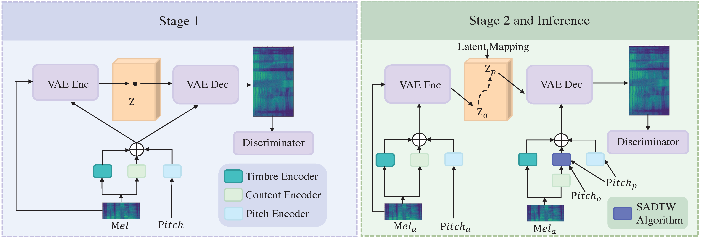
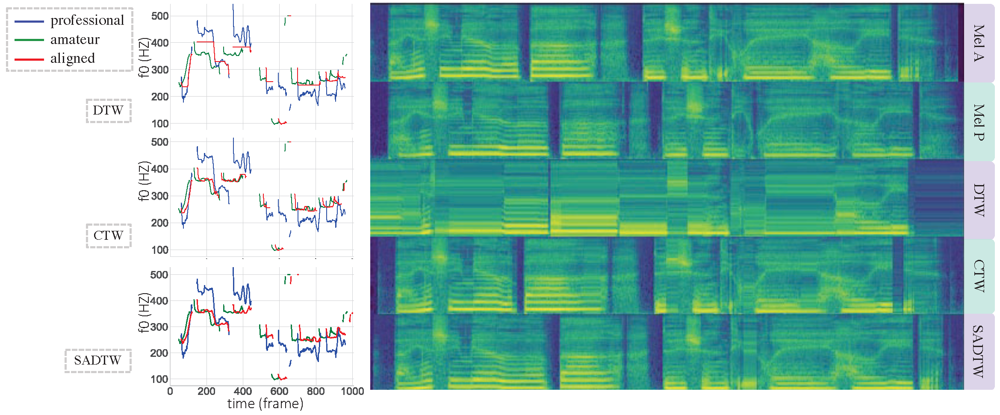

# Learning the Beauty in Songs: Neural Singing Voice Beautifier
Jinglin Liu, Chengxi Li, Yi Ren, Zhiying Zhu, Zhou Zhao

Zhejiang University

ACL 2022 Main conference

---
[](https://arxiv.org/abs/2202.13277)
[](https://github.com/MoonInTheRiver/NeuralSVB)


<div align="center">
    <a href="https://neuralsvb.github.io" target="_blank">Project&nbsp;Page</a>
</div>

<p align="center">:construction: :pick: :hammer_and_wrench: :construction_worker:</p>

This repository is the official PyTorch implementation of our ACL-2022 [paper](https://arxiv.org/abs/2202.13277). Now, we release the codes for `SADTW` algorithm in our paper. The current expected release time of the full version codes and data is at the ACL-2022 conference (before June. 2022). Please star us and stay tuned!
  
```
|--modules
    |--voice_conversion
        |--dtw
            |--enhance_sadtw.py  (Our algorithm)
|--tasks
    |--singing
        |--pitch_alignment_task.py  (Usage example)
```


:rocket: **News**: 
 - Feb.24, 2022: Our new work, NeuralSVB was accepted by ACL-2022. [Demo Page](https://neuralsvb.github.io).
 - Dec.01, 2021: Our recent work `DiffSinger` was accepted by AAAI-2022. [](https://github.com/MoonInTheRiver/DiffSinger) [](https://github.com/MoonInTheRiver/DiffSinger/releases) \| [](https://github.com/NATSpeech/NATSpeech).
 - Sep.29, 2021: Our recent work `PortaSpeech` was accepted by NeurIPS-2021. [](https://github.com/NATSpeech/NATSpeech). 
 - May.06, 2021: We submitted DiffSinger to Arxiv [](https://arxiv.org/abs/2105.02446).


## Abstract

We are interested in a novel task, singing voice beautifying (SVB). Given the singing voice of an amateur singer, SVB aims to improve the intonation and vocal tone of the voice, while keeping the content and vocal timbre. Current automatic pitch correction techniques are immature, and most of them are restricted to intonation but ignore the overall aesthetic quality. Hence, we introduce Neural Singing Voice Beautifier (NSVB), the first generative model to solve the SVB task, which adopts a conditional variational autoencoder as the backbone and learns the latent representations of vocal tone. In NSVB, we propose a novel time-warping approach for pitch correction: Shape-Aware Dynamic Time Warping (SADTW), which ameliorates the robustness of existing time-warping approaches, to synchronize the amateur recording with the template pitch curve. Furthermore, we propose a latent-mapping algorithm in the latent space to convert the amateur vocal tone to the professional one. Extensive experiments on both Chinese and English songs demonstrate the effectiveness of our methods in terms of both objective and subjective metrics. 

 


## Issues
 - Before raising a issue, please check our Readme and other issues for possible solutions.
 - We will try to handle your problem in time but we could not guarantee a satisfying solution.
 - Please be friendly.

